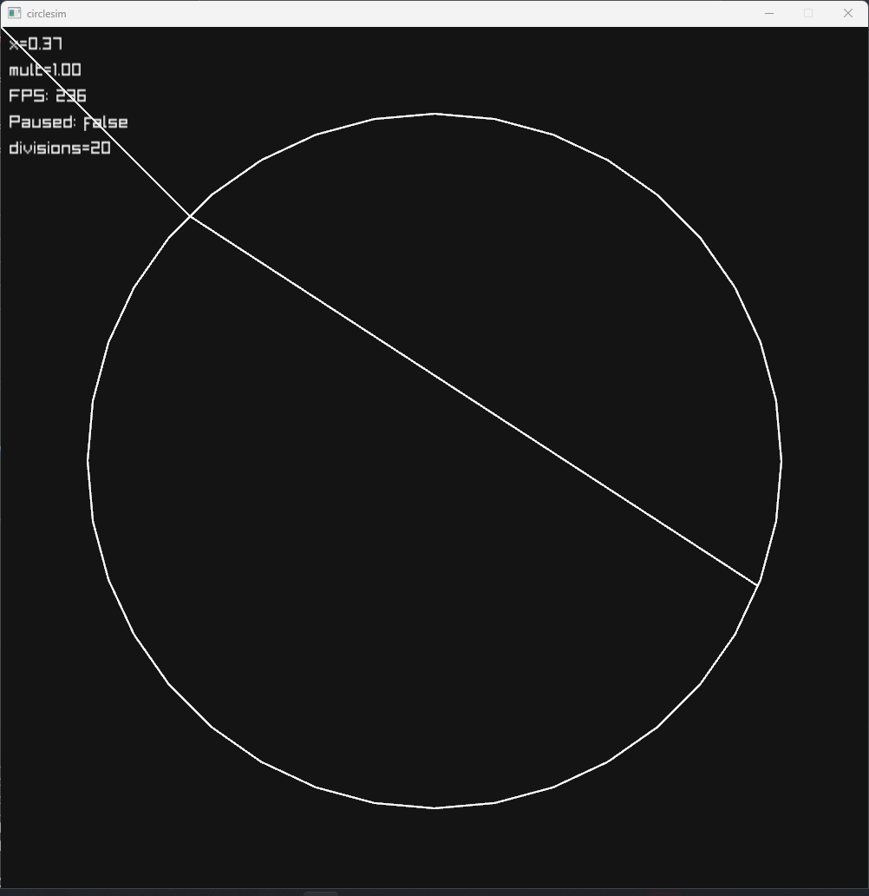
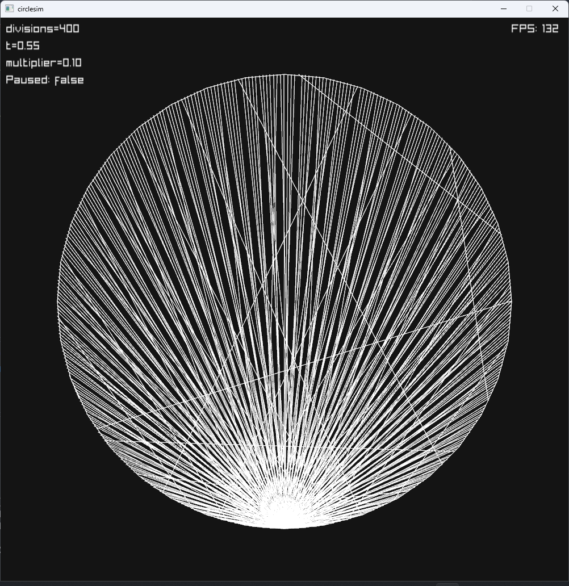

# circlesim
This is a simulation / math function visualizer that uses a circle.
This is inspired by [Visual Alchemy](https://www.youtube.com/@visual-alchemy)'s videos.

# controls
Set divisions with MouseWheel
Set speed with Shift+MouseWheel (faster with Ctrl+Shift+MouseWheel)
Toggle HUD (text) with F1

# screenshots

